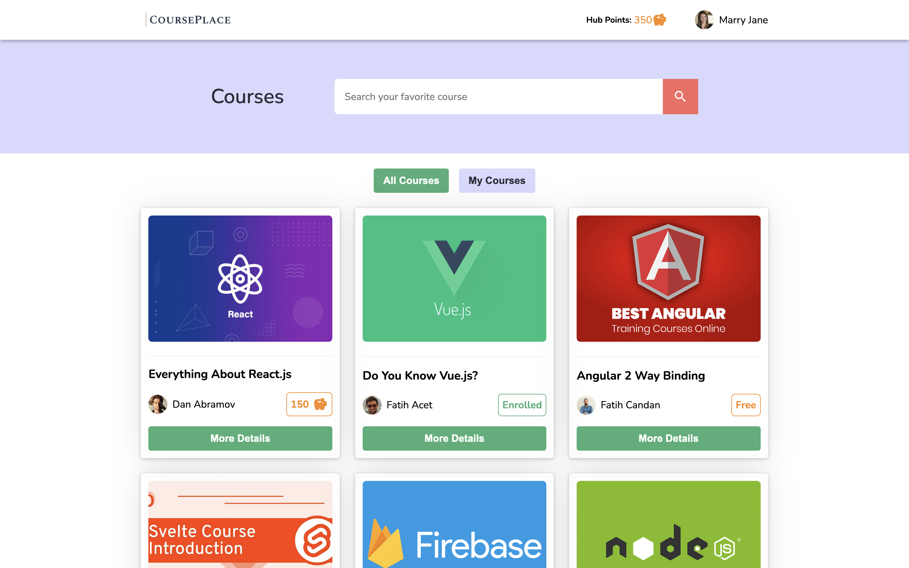
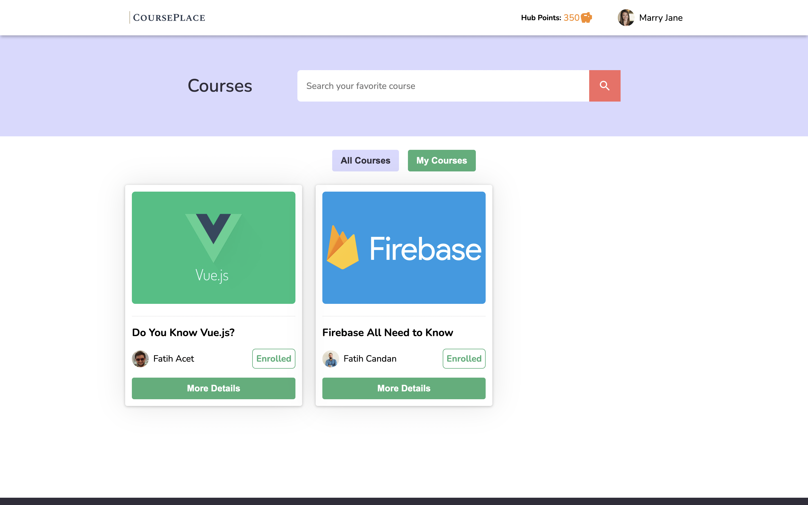
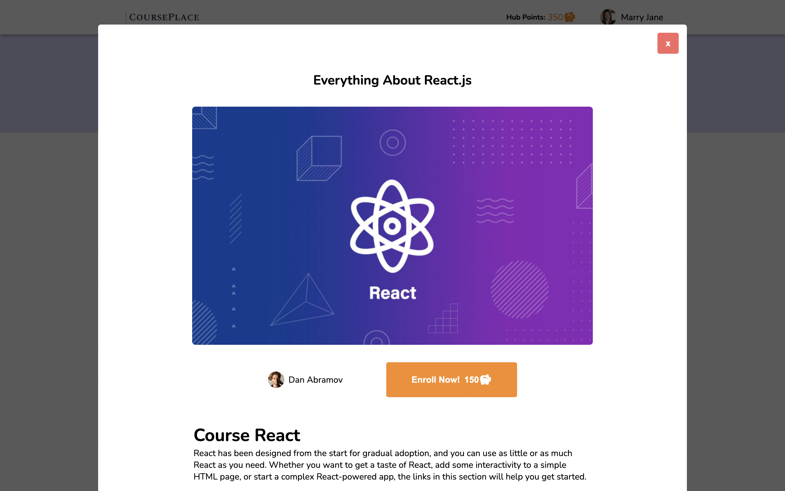

# Course Place - Online Education Marketing project

### Online Education Marketing Webapp 

-Built React without UI libraries. 
-This project contains Prettier & Eslint.

### `npm install` && `npm start`

Runs the app in http://localhost:3000

### Demo: https://course-place.vercel.app/
## Screenshots

